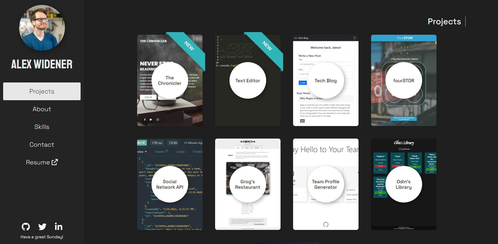
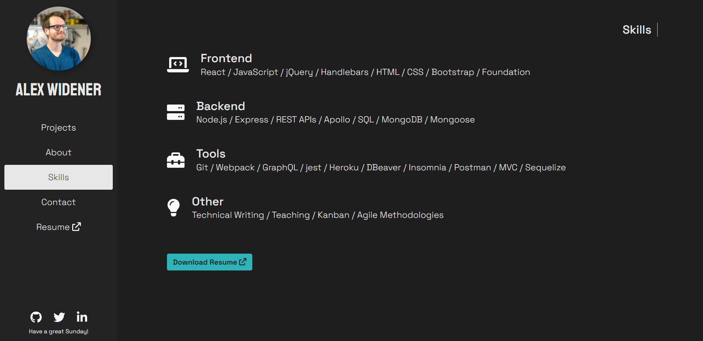
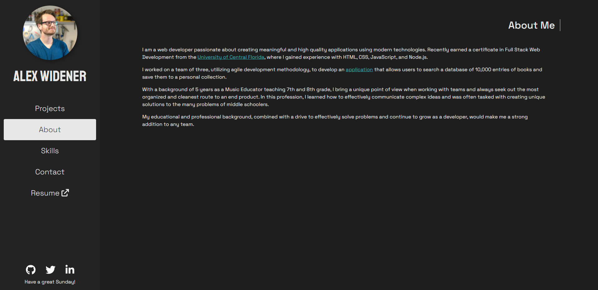
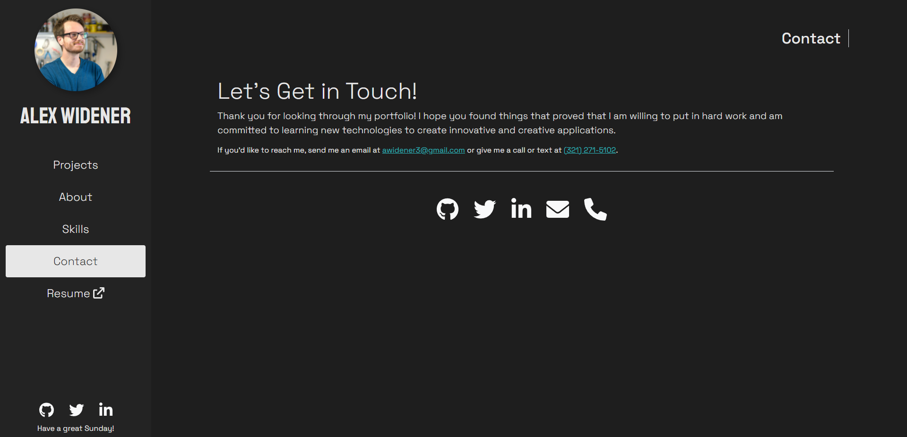
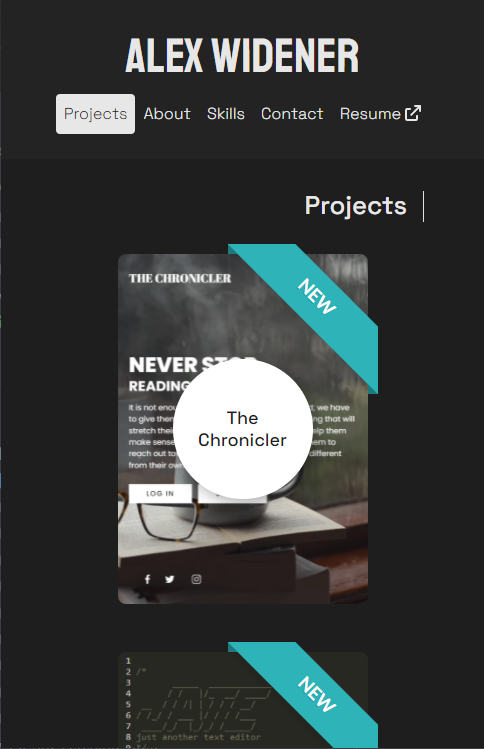
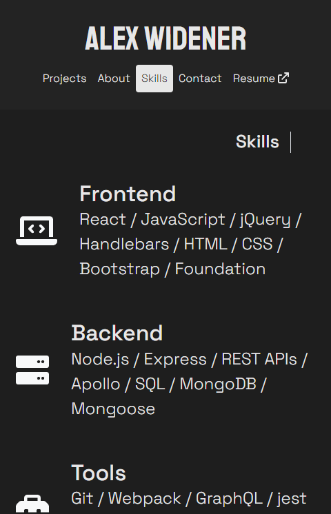
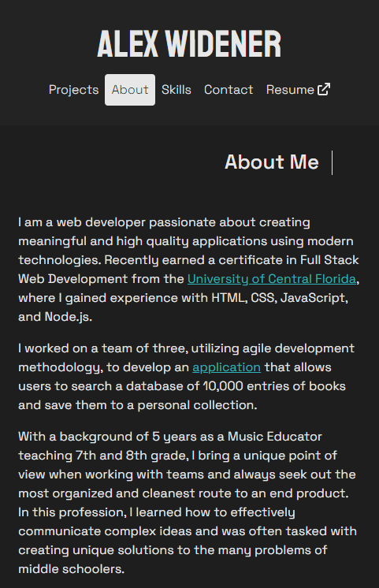
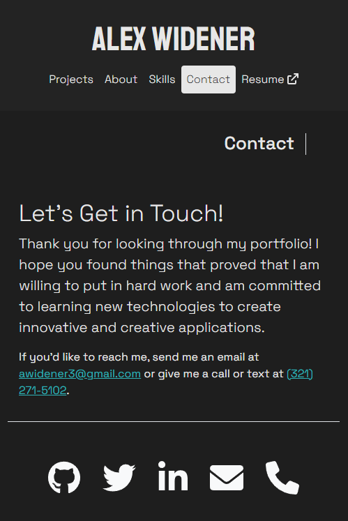

# Alex Widener Portfolio

📌 [Link to Deployed Portfolio](https://awidener3.github.io/portfolio/)

## 🔎 Overview
This portfolio is designed to highlight my skills and past projects. It also serves as documentation of my growth as a developer.

## 🧩 Tech Stack
- ReactJS
- JavaScript
- Bootstrap
- CSS

## 📎 Usage
To visit the portfolio, follow [this link](https://awidener3.github.io/portfolio-react/).

## 📷 Screenshots

### 💻 Desktop View

#### Projects

#### Skills

#### About

#### Contact

### 📱 Mobile View

#### Projects

#### Skills

#### About

#### Contact

